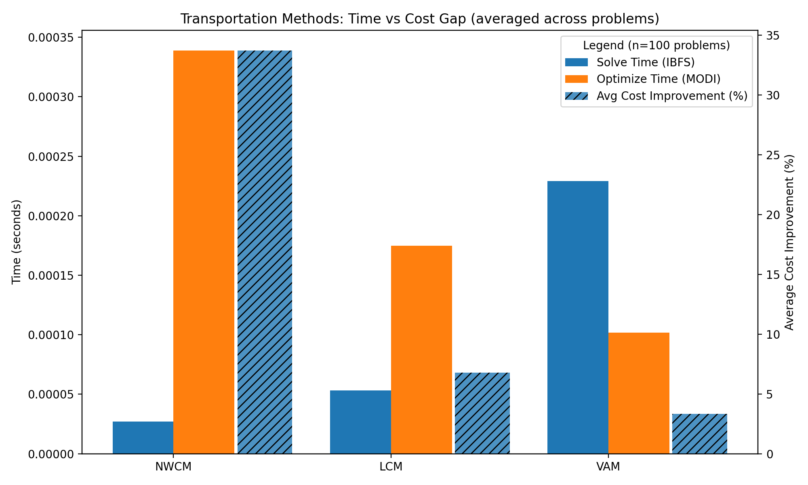

# 🚚 Operations Research – Transportation Problem - Extensive Computational Analysis

This repository implements and compares **classical methods** for solving the **Transportation Problem** in Operations Research:

- **NWCM** – North West Corner Method  
- **LCM** – Least Cost Method  
- **VAM** – Vogel’s Approximation Method  
- **MODI** – Modified Distribution Method (optimization)

It also includes:
- Random problem generation (balanced / unbalanced)
- Logging of results
- Time measurements for each algorithm
- Visualization of solve vs optimize performance (bar charts)

---

## Features
- Generate random supply, demand, and cost matrices (`balanced` or `unbalanced`)
- Compute **initial basic feasible solution (IBFS)** using NWCM, LCM, VAM
- Optimize IBFS using **MODI**
- Record timings (solve & optimize)
- Save results to `.csv` and `.txt`
- Plot performance comparison charts with **Matplotlib**

---

## Repository Structure
```
.
├── dataset/                        the dateset of the all the problems solved
├── plots/                          all the plots generated
├── create_graphs.py                create graphs of all the problems solved
├── generate_problems.py            generates problems with constraints (you can change them here)
├── LCM.py                          solves using Least Cost Method (LCM)
├── main.py                         main execution of the program, generates an average graph for the summary
├── MODI.py                         # MODI optimizer
├── NWCM.py                         solves using the North West Corner Method
├── plot_graphs.py                  creats a graph containing the average values of the time taken to solve and optimize a answer based on the method, and the percentage differnce in the optimization and the ibfs
├── README.md                       # This file 😎
├── test.py                         solves a problem using all the methods and prints the results on the terminal
├── timed.py                        tracks the execution time for each method and optimization
├── transportation.py               a copy of the code of all the methods
├── utils.py                        a function to print the problem and the meta data and a function to balance a unbalanced problem
└── VAM.py                          solves using Vogel's Approximation Method
```


---

## Quickstart

1. **Clone the repo**
   ```bash
   git clone https://github.com/atharvmunot004/operations_research_transportation_problems.git
   cd operations_research_transportation_problems


2. **Install requirements**

   ```bash
   pip install matplotlib numpy pandas
   ```

3. **Run main**

   ```bash
   python main.py
   ```

   This will:

   * Generate a random problem
   * Solve with NWCM, LCM, VAM
   * Optimize with MODI
   * Save allocations, logs, and summaries in `dataset/`

4. **Plot performance**

   ```bash
   python plot_transport_times.py --csv transportation_results.csv --avg
   ```

   This generates bar charts comparing solve vs optimize times.

---

## Example Output

### Console Summary

on execution of `python .\main.py`

```
Generated Transportation Problem ID: 624165
Generated Transportation Problem ID: 4044af
Generated Transportation Problem ID: 0580e5
Generated Transportation Problem ID: 76b5cf
Generated Transportation Problem ID: e05163
Generated Transportation Problem ID: ca4716
Generated Transportation Problem ID: a12d6e
Saved plot -> plots/methods_time_comparison.png
```

### Bar Chart



---

## Methods Explained

* **NWCM** – Simple, quick, but may give poor starting solutions.
* **LCM** – Chooses allocations based on the least cost cell greedily.
* **VAM** – Uses penalties (row/col differences) for smarter allocations.
* **MODI** – Optimizes any IBFS to the optimal solution.

---

## Logging

* all the problems are saved in `dataset/`
* Allocations are saved as `.csv` and `.json`
* Each run includes timings for solve and optimize

---

## Roadmap

* Add stepping stone method for optimization
* Extend to larger problem instances with benchmarking

---

## Contributing

PRs and suggestions are welcome!
Fork the repo, make your changes, and submit a pull request.

---

## License

MIT License © 2025 Atharv Munot
